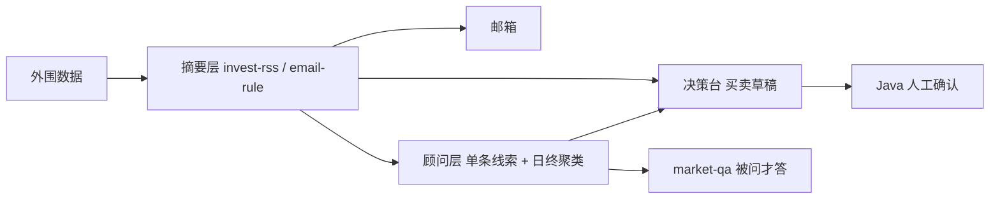
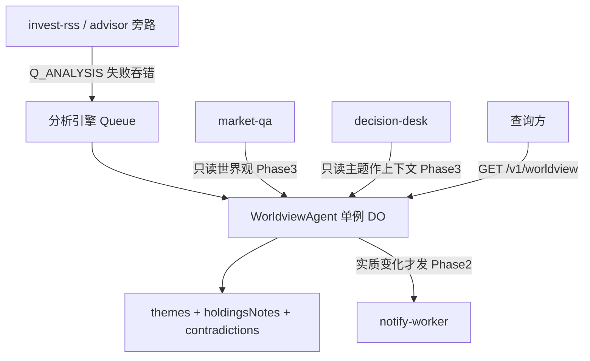

> 权威副本：`cloudflare_work/docs/analysis-engine-architecture.md`

> 文档版本：2026-08-16 rev3（实现定稿） · 状态：**Phase 1–3 已实现（dev_00_01_00）**
>
> 跨 Worker 架构权威副本在本文件。实现仓落地后，`analysis-engine-worker/docs/` 只留一行指针回这里。
>
> 方案草稿：[`.cursor/plans/有状态分析引擎_481a3f3b.plan.md`](../.cursor/plans/有状态分析引擎_481a3f3b.plan.md)

## 1. 概述

现有链路已覆盖「拉外围数据 → LLM 摘要 → 发信 → 单条行动线索 → 资金草稿 → 被问才答」。缺的是一份**随信号持续叠加、改写、保持在线**的判断。

`analysis-engine-worker` 是**无 UI 的世界观持有者**：上游旁路投递信号，单例 Durable Object 把新证据 merge 进活主题，对外提供「现在系统认为什么」。它不替代邮箱，不出买卖指令。

核心设计原则：

| 原则               | 含义                                                                                                                             |
| ------------------ | -------------------------------------------------------------------------------------------------------------------------------- |
| 叠加而非堆卡片     | 新信号改写既有 thesis，不是再开一条摘要                                                                                          |
| 线索 ≠ 判断 ≠ 指令 | advisor 出 `watch/research/risk_note`；本引擎出 thesis；desk 出 `buy/sell/rebalance`                                             |
| 旧路径零侵入       | 旁路失败吞错，不得拖垮摘要 / 发信 / 顾问                                                                                         |
| 有变化才打扰       | Phase 1 只落状态；Phase 2 才在 stance / confidence / 矛盾 / thesis 重大改写等实质变化时发信（materialChange 四条件见 §6 步骤 6） |
| 禁止买卖           | 与 [advisor prompt](../advisor-worker/prompts/advisor.md) 相同：不产出仓位、目标价、买卖                                         |

---

## 2. 现状与缺口



| 层     | 已有能力                                                      | 状态形态                        |
| ------ | ------------------------------------------------------------- | ------------------------------- |
| 摘要   | 分类、`ai_summary`、告警 / digest                             | 无记忆，每条独立                |
| 顾问   | `market_analysis` + `watch/research/risk_note`；日终 3–5 洞察 | 按条分析，聚类按日重置          |
| 决策台 | 按 underlying 聚合成买卖草稿                                  | 批处理，为下单服务              |
| 问答   | [market-qa-agent](../market-qa-agent/src/agent.ts)            | DO 只存最近问答，**不持有判断** |

人还在用邮箱和脑子当世界观。顾问聚类（[advice-cluster.ts](../advisor-worker/src/services/advice-cluster.ts)）是「当天压成 3 段」；决策台（[run-draft-batch.ts](../decision-desk-worker/src/services/run-draft-batch.ts)）是「聚完就出买卖」。两者都不是活着的论点。

### 2.1 人工仍在做的事

- **叠加**：新消息改写「我对美联储 / 黄金 / 某公司」的既有判断
- **持仓映射**：这条和仓位有没有关系、紧急不紧急
- **矛盾**：源 A 与源 B 打架时标出，而不是后一条覆盖前一条
- **何时打扰**：只有判断发生实质变化才通知
- **可查询的当前看法**：打开就能看到「现在系统认为什么」

### 2.2 为什么不塞进现有三个

- **不要加在 advisor**：[apply-agent.md](./apply-agent.md) 已定顾问是 Executor / 数据 Worker，禁止整体转 DO。
- **不要加深 market-qa**：它是拉式问答；每条信号都跑问答会烧配额，且 `AgentState` 只有 `lastQuestion/lastAnswer`。
- **不要加在 decision-desk**：职责是草稿；分析混进去会污染「线索 ≠ 指令」。

---

## 3. 目标架构



新建独立仓 `analysis-engine-worker`，首个开发分支 `dev_00_01_00`。

| 组件              | 角色                                                                                                                                                                                                                                                                                                             |
| ----------------- | ---------------------------------------------------------------------------------------------------------------------------------------------------------------------------------------------------------------------------------------------------------------------------------------------------------------- |
| `WorldviewAgent`  | **纯 Durable Object**（`implements DurableObject`，不用 Think/agents——合并窗口需独占 alarm 通道，agents 框架空闲时会 `deleteAlarm` 吞掉自定义 alarm），`idFromName("default")`；DO binding `{ name = "WorldviewAgent", class_name = "WorldviewAgent" }`；state 用 `ctx.storage` KV，证据流水用 `ctx.storage.sql` |
| `Q_ANALYSIS`      | 队列 `analysis-ingest`；consumer **只唤醒 DO**，不在 Queue 里调 LLM                                                                                                                                                                                                                                              |
| `SVC_LLM_GATEWAY` | merge / compact 走 `/v1/chat/invest`（`gtw_invest`）                                                                                                                                                                                                                                                             |
| `SVC_NOTIFY`      | Phase 1 即绑定（merge 失败 / 配额 defer 等 ops 告警用）；世界观发信仍 Phase 2：`sendNotifyAsync` + 独立 `ruleId`（如 `analysis-worldview`），通知可能有至多 30 分钟 digest 合并延迟，禁止并入 invest / advisor digest 窗口                                                                                       |

**串行化不变量**：同一时刻至多一个 merge 在读改写 Worldview state（alarm 单飞 + `blockConcurrencyWhile` 双保险，见 §6 步骤 0）。

**不要复用 `Q_DESK_SIGNAL`。** 决策台按高 importance / confidence 筛「可下单」；分析引擎需要更宽的流（含 `analysis` 类研报）。

---

## 4. 世界观状态

DO `setState` 只存压缩后的当前看法（主题上限 **8–12**）。证据流水用 DO SQLite 追加，供回溯，不塞进 state。

```ts
type Worldview = {
	version: number;
	updatedAt: number;
	themes: Theme[];
	holdingsNotes: HoldingNote[];
	openQuestions: string[];
};

type Theme = {
	id: string;
	topic: string;
	thesis: string;
	stance: 'bull' | 'bear' | 'watch' | 'unclear';
	confidence: number;
	/** 命中该主题的信号涉及的 symbol；Phase 1 无持仓数据，真实持仓映射由 Phase 4 holdingsNotes 承担 */
	symbolsTouched: string[];
	lastMaterialChangeAt: number;
	contradictions: {
		claimA: string;
		claimB: string;
		sourceIds: string[];
		status?: 'active' | 'resolved';
		resolvedAt?: number;
		/** 消解它的 source_id */
		resolvedBy?: string;
	}[];
};

type HoldingNote = {
	symbol: string;
	impact: string;
	urgency: 'low' | 'medium' | 'high';
	themeIds: string[];
};
```

`holdingsNotes` / `openQuestions` 在 Phase 4 才写入；Phase 1 schema 预留空数组。

state 体量约束：thesis 单条 ≤ 2KB、每主题 contradictions ≤ 10 条（实现时以 DO `setState` 平台上限复核）；compact 亦受此约束。

### 4.1 证据流水（DO SQLite）

建议表名 `evidence_log`（实现时以 migration / `onStart` DDL 为准）：

| 列            | 说明                                                                    |
| ------------- | ----------------------------------------------------------------------- |
| `id`          | 自增                                                                    |
| `source_type` | `invest_event` \| `advice_lead`                                         |
| `source_id`   | 上游幂等键（`eventId` 或 `advice:{id}:{underlying}`）                   |
| `theme_id`    | 命中或新建的主题；未归入则为空                                          |
| `summary`     | 进入 merge 的短证据                                                     |
| `created_at`  | unix 秒                                                                 |
| `merged_at`   | unix 秒；null = 待 merge（合并窗口，见 §6 步骤 1），由 alarm 批处理置位 |

`source_id` UNIQUE，队列重投不重复 merge。幂等检查在 ingest 入口执行，已存在即按 `accepted` 处理（见 §5.2 失败契约）。

保留策略：全局行数上限 N（建议 500–1000，env 可调），超出按 `created_at` 剪除，剪除语句与插入同批执行（先例 market-qa `qa_history` 200 条剪除）；下限须覆盖 `GET /v1/worldview/themes/:id` 的「最近证据」预期条数。

---

## 5. 信号与旁路

### 5.1 消息 envelope

与 desk 信号共享语义子集（字段语义对齐、**独立类型**，不可直接复用 `isDeskSignal` 校验）、**独立队列**。类型与校验器落在 `framework_sdk_worker/analysis/analysis-signal`（`isAnalysisSignal` / `buildAnalysisSignalId` / `analysisSignalImportance`）。过滤比 desk **更宽**：实现时用 `ANALYSIS_INVEST_MIN_IMPORTANCE`（默认 7，低于投递侧 `DESK_SIGNAL_MIN_IMPORTANCE`=8）；advice 侧用 `ANALYSIS_ADVICE_MIN_CONFIDENCE`（对照 `DESK_SIGNAL_MIN_CONFIDENCE`=0.6）。

```ts
type AnalysisSignal =
	| {
			type: 'invest_event';
			eventId: string;
			underlying?: string;
			importance: number;
			title: string;
			tags: string[];
			aiSummary: string | null;
			category?: string;
			createdAt: number;
			traceId?: string;
	  }
	| {
			type: 'advice_lead';
			adviceId: number;
			underlying: string;
			action: 'watch' | 'research' | 'risk_note';
			rationale: string;
			confidence: number;
			sourceId: string;
			name?: string;
			traceId?: string;
	  };
```

幂等键：`event:{eventId}` / `advice:{adviceId}:{underlying}`。

### 5.2 Producer 投递点

fire-and-forget，`try/catch` 吞错，不阻断主路径。仿 [enqueue-desk-signal.ts](../advisor-worker/src/services/enqueue-desk-signal.ts)。

| 上游       | 时机                                                                                                             | 现有旁路（勿改语义）         | 新增                                    |
| ---------- | ---------------------------------------------------------------------------------------------------------------- | ---------------------------- | --------------------------------------- |
| invest-rss | LLM enrich 成功，[applyEnrichmentAndRoute](../invest-rss-worker/src/services/llm-enrich/route-after-llm.ts) 末尾 | `bypassToDecisionDesk`       | `bypassToAnalysisEngine` → `Q_ANALYSIS` |
| advisor    | [analyzeSummary 与 retryAnalyze 两处](../advisor-worker/src/services/analyze-advice.ts) 成功后                   | `bypassAdviceToDecisionDesk` | 同文件旁路再投 `Q_ANALYSIS`             |

Queue consumer：校验 envelope → 经 DO binding stub 唤醒 `WorldviewAgent.ingest` → ack。LLM 只在 DO 内调用（且只在 alarm 合并窗口内调用）。**业务队列 `max_retries = 5`**——consumer 本身无 LLM，配额与 Evaluator 拒绝都发生在 DO merge 期，不占队列重试（遵循 [cloudflare-worker-queue-retry](../.cursor/rules/cloudflare-worker-queue-retry.mdc)）。

失败契约（DO 返回 → consumer 行为）：

| DO 返回                                          | consumer 行为                                                                            |
| ------------------------------------------------ | ---------------------------------------------------------------------------------------- |
| 200 `accepted`（含 source_id 已存在 → 幂等接受） | ack                                                                                      |
| 5xx / 抛错（存储错误、DO 不可达等瞬态）          | retry（delay ≥ 60s），5 次后 ack + `reportOpsError`（reason: `analysis_ingest_give_up`） |
| 400（envelope 非法，消费侧校验不过）             | ack + `reportOpsError`（reason: `analysis_ingest_invalid_body`）                         |

merge 期（alarm 内，ack 之后）的失败处理见 §6 步骤 5：Evaluator 硬拒绝 → 证据标记已处理 + `reportOpsError`（`analysis_merge_rejected`）；瞬态失败 → pending 保留、下个窗口重试；配额耗尽 → `setAlarm(次日 UTC 0 点)` + 按日 dedup 的 `reportOpsError`（`analysis_quota_defer`）。`reportOpsError` 分档模板 decision-desk `desk-signal-consumer.ts`。fail-open：merge / LLM 失败不得破坏既有世界观（state 保持原值）；日配额与熔断复用顾问同一套（`chatInvest` → `gtw_invest`），引擎不另建预算系统。

---

## 6. 叠加算法

0. **串行化不变量**：同一时刻至多一个 merge 在读改写 Worldview state。merge 由 alarm 单飞驱动（步骤 1），再包 `blockConcurrencyWhile` 双保险；代价是 merge 时延串行化，consumer 重试 delay（≥ 60s）须大于典型 merge 时长。
1. 新信号入队 → 唤醒 DO。ingest 用确定性命中（步骤 2）把 theme_id 写入 evidence_log（`merged_at` 为空 = 待 merge）并设 alarm（alarm 单次触发，处理完按需重设）。**合并窗口（Phase 1 规格）**：alarm 按 theme_id 分组，60–120s 聚合批量 merge，一次 prompt 吃多条证据——省 LLM 次数、收窄并发交错面、多证据互证。
2. 确定性命中在 ingest 期：用 symbol / tags / topic 规则命中已有 theme 写 theme_id；未命中 theme_id=null，merge 期按 null 分组走 new-theme prompt（LLM 可改判 update 既有主题，一次调用兼模糊匹配）。主题在窗口内被归档/合并则归入未命中组。
3. 命中：增量 merge prompt = 当前 thesis + 批内新证据，输出「维持 / 修正 / 升矛盾 / 消解矛盾」；消解只能标已有 contradiction 为 resolved，不得捏造新 id。
4. 未命中且够重要：开新 theme。超上限先 compact：
   - 过期：`lastMaterialChangeAt` 距今 > N 天（env 参数）且 confidence ≤ θ → 归档（移出 themes，evidence_log 保留）；
   - 过期后仍超限 → 强制合并最相似主题对（优先 confidence 最低、最久未动的）；
   - 仍失败 → 拒绝开新主题，信号仅落 evidence_log（theme_id 为 null）。
     compact 本身耗 LLM，计入合并窗口与配额。
5. Hybrid Evaluator 不通过 → 不 `setState`，该批证据标记已处理，`reportOpsError`（不重试——硬拒绝在同输入下近乎确定性）；merge 期瞬态失败（LLM 5xx / 超时）→ pending 保留、下个窗口重试，连续 N 次后 `reportOpsError` 放弃；ingest 期失败走 §5.2 失败契约。
6. 仅当 `materialChange=true` 才更新 `lastMaterialChangeAt`。四条件：stance 变 / confidence 跳变 ≥ Δ（env 参数，建议默认 0.15–0.2）/ 新矛盾 / thesis 实质改写（merge 输出 `changeKind ∈ {none, minor, material}`，硬条件满足必为 material）。Phase 1 不发信。

### 6.1 Evaluator（硬规则）

| 规则                                       | 失败处理                                                                  |
| ------------------------------------------ | ------------------------------------------------------------------------- |
| 输出 JSON 可解析，字段齐全                 | 重试 1 次后放弃本条 merge（仅限 JSON/字段质量；配额错误不重试、立即上抛） |
| `sourceId` 必须来自本条信号或已有 evidence | 拒绝（禁止捏造）                                                          |
| 矛盾消解只能标已有 contradiction id        | 拒绝（禁止捏造新 id）                                                     |
| 不得出现 buy / sell / 仓位 / 目标价        | 拒绝                                                                      |
| thesis 须引用新证据，或明确「无增量」      | 拒绝                                                                      |
| theme 数 ≤ 上限                            | 先 compact 再接受                                                         |
| stance / confidence 类型合法               | 拒绝                                                                      |

软评判（可选 LLM judge）不得覆盖硬规则。范式见 [抽象-spec.md](./抽象-spec.md)。

---

## 7. API（Phase 1）

鉴权：Bearer `ANALYSIS_ADMIN_TOKEN`（Store 可与 `RULES_ADMIN_TOKEN` 同值对照，见 [secrets-inventory.md](./secrets-inventory.md)；新建时按 `[校验方域]_[用途]_TOKEN`）。

| 方法 | 路径                       | 说明                                                                                                                          |
| ---- | -------------------------- | ----------------------------------------------------------------------------------------------------------------------------- |
| GET  | `/v1/worldview`            | 当前压缩看法（themes + 空 holdingsNotes）                                                                                     |
| GET  | `/v1/worldview/themes/:id` | 单主题 + 最近证据                                                                                                             |
| POST | `/internal/ingest`         | 手动灌一条 `AnalysisSignal`（调试；Bearer `ANALYSIS_ADMIN_TOKEN` **且** `ANALYSIS_INGEST_DEBUG_ENABLED=1`，生产默认返回 404） |

Phase 1 **不**做 Chat UI；问答仍走 market-qa。

Phase 3 读侧预留：market-qa / desk 经 `SVC_ANALYSIS` binding 访问，token 与 `ANALYSIS_ADMIN_TOKEN` 同值映射；落地时登记 secrets-inventory。

---

## 8. 分阶段

第一刀是 **主题叠加**：信息进来就更新，后面持仓映射、矛盾打扰都踩在这上面。

| 阶段    | 状态 | 内容                                                                                                                                                                                                                                                                 |
| ------- | ---- | -------------------------------------------------------------------------------------------------------------------------------------------------------------------------------------------------------------------------------------------------------------------- |
| Phase 1 | ✅   | 新仓 + `WorldviewAgent` + `Q_ANALYSIS` + 双上游旁路 + 合并窗口 + merge/compact/Evaluator + `GET /v1/worldview`；不发信。登记：secrets-inventory（`ANALYSIS_ADMIN_TOKEN`，Store 与 `RULES_ADMIN_TOKEN` 同值映射）+ pipeline-registry.yaml（`analysis-engine-worker`） |
| Phase 2 | ✅   | 实质变化 → `SVC_NOTIFY` `sendNotifyAsync`（主题、旧→新、证据）；独立 `ruleId`（`analysis-worldview`），通知可能有至多 30 分钟 digest 合并延迟                                                                                                                        |
| Phase 3 | ✅   | market-qa 先读世界观再决定是否拉原始事件；desk draft prompt 附相关 `theme.thesis`（desk 仍独立出买卖）；market-data-mcp 合并第四份 OpenAPI                                                                                                                           |
| Phase 4 | 🔲   | 拉 fund-monitor 写 `holdingsNotes`；`openQuestions` 作 market-qa 追问种子                                                                                                                                                                                            |

---

## 9. 明确不做

- 不替换邮箱路径，不改 digest 语义
- 不把 advisor 改成 DO
- 不在 Phase 1 做 Chat UI
- 不在本引擎出资金任务
- 不复用 `Q_DESK_SIGNAL` 当分析队列

---

## 10. 实现时关键文件

| 用途             | 路径                                                                                                                                        |
| ---------------- | ------------------------------------------------------------------------------------------------------------------------------------------- |
| 顾问旁路模板     | [advisor-worker/src/services/enqueue-desk-signal.ts](../advisor-worker/src/services/enqueue-desk-signal.ts)                                 |
| 分析信号类型模板 | [framework_sdk_worker/src/desk/desk-signal.ts](../framework_sdk_worker/src/desk/desk-signal.ts)（仿此建 `src/analysis/analysis-signal.ts`） |
| invest 旁路点    | [invest-rss-worker/src/services/llm-enrich/route-after-llm.ts](../invest-rss-worker/src/services/llm-enrich/route-after-llm.ts)             |
| Agent / DO 模板  | [market-qa-agent/src/agent.ts](../market-qa-agent/src/agent.ts)（仅参考 DO fetch/SQL 用法；本引擎用纯 DO，且是 push 更新不是 pull 问答）    |
| 禁止买卖约束     | [advisor-worker/prompts/advisor.md](../advisor-worker/prompts/advisor.md)                                                                   |
| 顾问不转 DO      | [apply-agent.md](./apply-agent.md)                                                                                                          |
| 决策台边界       | [decision-desk-architecture.md](./decision-desk-architecture.md)                                                                            |

---

## 11. 相关文档

- [invest-rss-architecture.md](./invest-rss-architecture.md) — 摘要层与 LLM enrichment
- [apply-agent.md](./apply-agent.md) — 顾问聚类 + market-qa；本引擎是第三条路径
- [decision-desk-architecture.md](./decision-desk-architecture.md) — 买卖草稿
- [market-qa-agent-integration.md](./market-qa-agent-integration.md) — 拉式问答
- [抽象-spec.md](./抽象-spec.md) — Hybrid Evaluator
- [投资顾问Agent模块需求文档.md](./投资顾问Agent模块需求文档.md) — 顾问单条分析（本引擎不替代）
