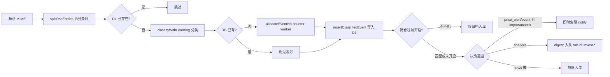
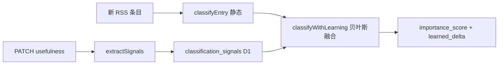
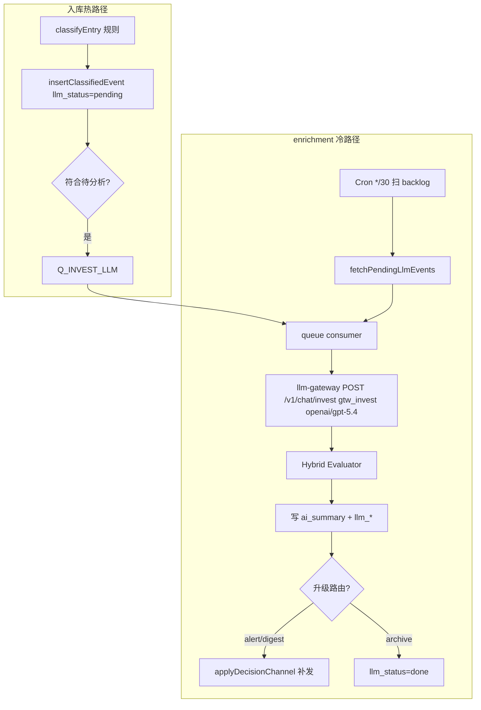
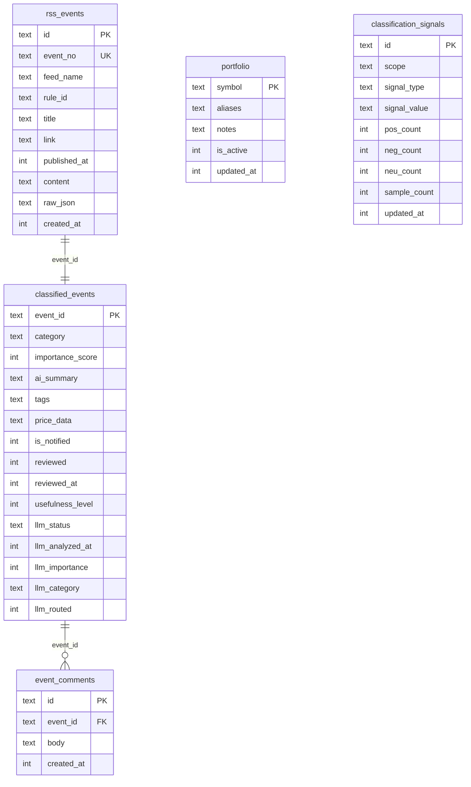

> 权威副本：`cloudflare_work/docs/invest-rss-architecture.md`

> 文档版本：2026-07-06 · 对应 invest-rss-worker `dev_00_05_00`

## 1. 概述

本架构解决 **RSS 投资信息过载** 问题：用户不应成为「信号接收器」，而应是 **策略编写者与最终决策人**。系统将海量 Blogtrottr / RSS 邮件转化为 **结构化事件、分级推送与可评审看板**，只把与持仓相关、高价值的信息送到决策通道。

核心设计原则：

| 原则         | 含义                                                   |
| ------------ | ------------------------------------------------------ |
| 双轨分离     | 普通订阅与投资 RSS 使用不同邮箱、不同 Worker，互不干扰 |
| 先过滤再打扰 | 持仓过滤 + 分类 + 优先级，决定「是否推送」             |
| 全量入库     | 即使不推送，条目仍写入 D1，供 Dashboard 回溯与评审     |
| 分发统一     | 所有发信经 `notify-worker`，digest 30 分钟窗口合并     |
| 人工闭环     | Dashboard 支持已读、有用度 1–5 星、评论，沉淀主观判断  |

---

## 2. 总体架构

```mermaid
flowchart TB
  subgraph sources [信息源]
    BT[Blogtrottr / RSS 聚合]
    HN[HN / V2EX 等普通 feed]
  end

  subgraph routing [Cloudflare Email Routing]
    INVEST[invest@mailworld.uk]
    DIGEST[digest@mailworld.uk]
  end

  subgraph workers [Workers]
    IRW[invest-rss-worker]
    ERW[email-rule-worker]
    NW[notify-worker]
    LLM[llm-gateway-worker]
    CTR[counter-worker]
  end

  subgraph storage [存储]
    D1[(D1 invest-rss)]
    KV_I[KV_INVEST_RULES]
    KV_E[KV_EMAIL_RULES]
    KV_N[KV_NOTIFY]
  end

  subgraph ui [管理界面]
    ADMIN[/admin 规则·持仓]
    DASH[/dashboard 事件看板]
  end

  BT --> INVEST
  BT --> DIGEST
  HN --> DIGEST

  INVEST --> IRW
  DIGEST --> ERW

  IRW --> D1
  IRW --> KV_I
  IRW --> NW
  ERW --> KV_E
  ERW --> LLM
  IRW --> LLM
  IRW --> CTR
  ERW --> NW

  NW --> KV_N
  NW --> Outbound[Email Sending / Resend]

  IRW --> ADMIN
  IRW --> DASH
  DASH --> D1
```

### 2.1 仓库与部署单元

| 仓库                 | 路径                      | 当前 dev 分支（参考） | 角色                                                             |
| -------------------- | ------------------------- | --------------------- | ---------------------------------------------------------------- |
| invest-rss-worker    | `invest-rss-worker/`      | `dev_00_05_00`        | 投资 RSS 专用轨                                                  |
| email-rule-worker    | `email-rule-worker/`      | `dev_00_08_00`        | 普通订阅轨（LLM/raw digest）                                     |
| notify-worker        | `notify-worker/`          | `dev_00_10_00`        | 统一邮件通知与 digest 合并（CF Email Sending / Resend 策略）     |
| llm-gateway-worker   | `llm-gateway-worker/`     | —                     | email-rule LLM 摘要 + **invest enrichment**（`/v1/chat/invest`） |
| counter-worker       | `counter-worker/`         | `dev_00_01_00`        | 按天自增业务编号（prefix `INV`）                                 |
| framework_sdk_worker | `../framework_sdk_worker` | —                     | 共享 HTTP / notify / auth / **id-generator** 工具                |
| strategy-monitor     | `strategy-monitor/`       | —                     | 金价等策略监控（**尚未与 RSS 事件联动**）                        |

各 Worker 为 **独立 Git 仓库**，分支命名 `dev_XX_YY_ZZ`，部署互不影响。

---

## 3. 双轨邮件架构

### 3.1 为什么分离

| 维度      | 普通轨                           | 投资轨                        |
| --------- | -------------------------------- | ----------------------------- |
| 收件地址  | `digest@mailworld.uk`            | `invest@mailworld.uk`         |
| Worker    | email-rule-worker                | invest-rss-worker             |
| 规则存储  | KV `KV_EMAIL_RULES`              | KV `KV_INVEST_RULES`          |
| 持久化    | 无 D1（digest 入队即走）         | D1 `invest-rss` 全量事件      |
| 处理方式  | LLM 摘要 / 原文 digest / forward | 规则分类 → D1 → 告警或 digest |
| 典型 feed | Hacker News、V2EX                | 金十、研报、行情类 Blogtrottr |

Blogtrottr 填址时 **按 feed 类型区分**：投资 feed → `invest@`；技术/生活 feed → `digest@`。

### 3.2 email-rule-worker 简要流程

```
收到邮件 → headers 规则匹配
  ├─ 未命中 → forward(PASS_THROUGH_TO)
  ├─ forward 模式 → 即时 forward
  ├─ raw_digest → notify-worker 异步 digest 入队
  └─ llm_digest → LLM 摘要 → notify digest 入队（额度不足则 Queue 次日重试）
```

投资规则 **不应** 配置在 email-rule-worker 的 KV 中。

---

## 4. invest-rss-worker 处理流水线

### 4.1 入口

1. Cloudflare **Email Routing**：`invest@` → `invest-rss-worker` 的 `email()` handler
2. 按 `InvestRule`（KV）匹配 from / subject
3. 未命中或处理失败 → `forwardPassThrough` 到 `PASS_THROUGH_TO`

### 4.2 单封邮件处理（`processInvestEmail`）



**关键行为：**

- **全量入库**：每条有效 RSS 条目写入 `rss_events` + `classified_events`
- **业务编号**：新条目经 `SVC_COUNTER` → counter-worker 分配 `event_no`（prefix `INV`，如 `INV20260706000001`）；dedup 主键仍为 `dedupPrefix:link`；发号失败时降级入库（`event_no` 为空）
- **持仓过滤**（Phase 2）：`portfolio` 表非空时，仅与 symbol/aliases 匹配的条目进入告警与 analysis digest；不匹配仍入库但不打扰 inbox
- **去重**：D1 `rss_events.id`（`dedupPrefix:link`）为主；命中则跳过分类与入库。发信去重由 **notify-worker** `KV_NOTIFY` 负责（成功发信后 markSent）

### 4.3 分类体系（`classifyEntry`）

纯规则引擎，**不调用 LLM**（低成本、可单测）：

| category      | 触发条件（关键词示例）       | 默认 importance                 |
| ------------- | ---------------------------- | ------------------------------- |
| `event`       | 突发、加息、非农、CPI、财报… | 9                               |
| `price_alert` | 价格、BTC、黄金、突破、涨幅… | 8（附带 `price_data` 正则解析） |
| `analysis`    | 分析、报告、展望、研报…      | 6                               |
| `news`        | 其余                         | 3                               |

### 4.3.1 有用度演化分类（Phase 7，Bayesian Learning）

Dashboard 有用度 1–5 星不再只影响 LLM skip，而是 **反馈到后续优先级判别**：



| 机制     | 说明                                                     |
| -------- | -------------------------------------------------------- |
| 信号提取 | 标题关键词、tags、link domain、feed_name                 |
| 分域     | **global** + **feed_name** 两套独立计数                  |
| 后验     | Beta(1,1) 先验；4–5 星 → pos，1–2 星 → neg，3 星 → neu   |
| 融合     | 学习权重最高 60%；宏观/价格强信号不被覆盖                |
| 存储     | D1 `classification_signals`；分类时直查 D1（无 KV 缓存） |

API：`GET /v1/classification-signals?scope=global|{feed}` · `DELETE /v1/classification-signals/:id`

### 4.4 三条输出通道

| 通道                    | 条件                                                                     | 实现                                                                    | 频率       |
| ----------------------- | ------------------------------------------------------------------------ | ----------------------------------------------------------------------- | ---------- |
| 🚨 决策通道（即时告警） | `price_alert` / `event` 且 importance ≥ `ALERT_IMPORTANCE_MIN`（默认 8） | `sendNotify` → notify 出站策略                                          | 即时       |
| 📊 分析 digest          | `category === analysis`                                                  | `sendNotifyAsync`，`ruleId: invest-{ruleId}`，notify-worker 30 分钟合并 | 随邮件到达 |
| 📋 日终汇总表           | Cron UTC 13:00（≈ 上海 21:00）                                           | `runDailyDigest`：近 24h analysis 条 HTML 表格                          | 每日一次   |
| 🗑️ 静默归档             | `news` 或低优先级                                                        | 仅 D1 + dedup，不推送                                                   | —          |

环境变量阈值（**Dashboard 可覆盖**，存 KV `invest_decision_settings` / `invest_llm_settings`，无需 redeploy）：

| 变量                          | 默认 | 说明                          |
| ----------------------------- | ---- | ----------------------------- |
| `ALERT_IMPORTANCE_MIN`        | 8    | 即时告警门槛                  |
| `DAILY_DIGEST_IMPORTANCE_MIN` | 5    | 30min digest + 日终表格最低分 |
| `LLM_ENRICH_MIN`              | 4    | LLM enrichment 最低 priority  |

`KV_INVEST_RULES` 用于规则配置、LLM/发信门槛（低频 write）。`DEDUP_TTL_SECONDS` 已不再用于 invest 条目去重。

### 4.5 LLM 批处理 enrichment（Phase 6，冷路径）

热路径（收信）仍 **无 LLM**；规则分类后的灰色地带由异步 enrichment 二次研判。



**设计原则：**

- LLM 是 **Critic/Enrichment**，规则分类结果保留可追溯
- 模型 `openai/gpt-5.4` + AI Gateway **`gtw_invest`**（与 email-rule 的 `default` 分离）
- invest-rss 仅配置 `LLM_GATEWAY_AUTH_TOKEN`；**Worker 侧无需 OpenAI Key**
- `/v1/chat/invest` **跳过 Neurons 预检**（BYOK 经 Gateway 计费）
- 升级路由 **幂等**：`llm_routed=1` 后不再补发；热路径已 `digest_enqueued` 则跳过 digest 补发；digest→alert 升级可用 `llm-route:alert:`；digest 补发与热路径共用同一 `itemDedupKey`

**待分析入队条件（默认）：**

| 条件                                 | 默认                         | 说明                            |
| ------------------------------------ | ---------------------------- | ------------------------------- |
| `ai_summary IS NULL`                 | 必须                         | 未分析过                        |
| `importance_score >= LLM_ENRICH_MIN` | 4                            | 过滤纯噪音 news                 |
| category                             | news / analysis / borderline | 热路径已告警项可低优先级        |
| 有用度 ≤ 2                           | 排除                         | 人工差评 → `llm_status=skipped` |

Cron 每 30 分钟扫描 `pending`（7 天内），batch 上限 `LLM_ENRICH_BATCH_SIZE`（默认 10）。

---

## 5. D1 数据模型

数据库名：`invest-rss`（binding `DB_INVEST`）



### 5.1 迁移文件

| 文件                               | 内容                                                         |
| ---------------------------------- | ------------------------------------------------------------ |
| `0001_init.sql`                    | `rss_events`、`classified_events`                            |
| `0002_portfolio.sql`               | `portfolio` 持仓过滤                                         |
| `0003_event_feedback.sql`          | `usefulness_level`、`event_comments`                         |
| `0004_llm_enrichment.sql`          | `llm_status`、`llm_importance`、`llm_category`、`llm_routed` |
| `0007_event_no.sql`                | `rss_events.event_no`（counter-worker 发号，prefix `INV`）   |
| `0008_classification_learning.sql` | `classification_signals`、学习调试列                         |

发号对接详见 `cloudflare_work/docs/counter-worker-integration.md`。

---

## 6. API 与管理界面

### 6.1 鉴权

- 路径：`/v1/rules`、`/v1/portfolio`、`/v1/events` 及子路径
- 方式：`Authorization: Bearer {RULES_ADMIN_TOKEN}`
- Secret **按 Worker 独立配置**；可与 email-rule-worker 使用相同字符串，但需分别 `wrangler secret put`
- 建议 Cloudflare Access 保护 `/admin`、`/dashboard` 页面路径

### 6.2 Admin（`/admin`）

- Feed 规则 CRUD（KV `KV_INVEST_RULES`）
- 持仓配置（D1 `portfolio`）：`symbol` + `aliases[]`
- 与 Dashboard 共用 sessionStorage 键 `invest-rss-admin-token`

### 6.3 Dashboard（`/dashboard`）

Phase 4 能力：

| 功能       | 说明                                                            |
| ---------- | --------------------------------------------------------------- |
| 事件列表   | 筛选 category / feed / 优先级 / 已读 / 有用度 / **LLM 状态**    |
| 统计卡片   | 总计、未读、已评有用度、分类计数                                |
| 已读标记   | PATCH `/v1/events/:id/reviewed`                                 |
| 有用度评审 | 1–5 星（无价值 → 非常有用）                                     |
| 用户评论   | 行内展开，GET/POST/DELETE comments                              |
| LLM 摘要   | 标题下展示 `ai_summary`；筛选 pending / done / failed / skipped |

线上示例：`https://invest-rss-worker.atmosphere-drone.workers.dev/dashboard`

### 6.4 主要 API 一览

| 方法     | 路径                                 | 说明                                                                      |
| -------- | ------------------------------------ | ------------------------------------------------------------------------- |
| GET/PUT  | `/v1/rules`                          | Feed 规则                                                                 |
| GET/PUT  | `/v1/portfolio`                      | 持仓                                                                      |
| GET      | `/v1/events`                         | 事件列表（含 `eventNo`、`llmStatus`、`usefulness`、`minUsefulness` 筛选） |
| GET      | `/v1/events/stats`                   | 统计                                                                      |
| PATCH    | `/v1/events/:id/reviewed`            | 已读                                                                      |
| PATCH    | `/v1/events/:id/usefulness`          | 有用度 1–5 或 null（触发信号学习）                                        |
| GET      | `/v1/classification-signals`         | 已学习信号 Top 列表                                                       |
| DELETE   | `/v1/classification-signals/:id`     | 重置单条噪声信号                                                          |
| GET/POST | `/v1/events/:id/comments`            | 评论                                                                      |
| DELETE   | `/v1/events/:id/comments/:commentId` | 删评论                                                                    |

---

## 7. counter-worker 发号

新 RSS 条目入库前，经 **Service Binding** `SVC_COUNTER` + `COUNTER_AUTH_TOKEN` 调用 counter-worker：

```typescript
import { generateId } from 'framework_sdk_worker/id-generator';
// 封装见 src/services/allocate-event-no.ts
```

| 项         | 值                                     |
| ---------- | -------------------------------------- |
| prefix     | `INV`                                  |
| 格式       | `INV` + `yyyyMMdd` + 6 位序号          |
| 失败策略   | 降级：`event_no` 留空，不阻断 RSS 入库 |
| dedup 主键 | 不变（`dedupPrefix:link`）             |

---

## 8. notify-worker 共享层

所有 Worker 通过 **Service Binding** `SVC_NOTIFY` + `NOTIFY_AUTH_TOKEN` 调用：

| 调用方式                 | 用途             | invest-rss 使用场景                      |
| ------------------------ | ---------------- | ---------------------------------------- |
| `sendNotify`             | 即时单封邮件     | 高优先级 price_alert / event             |
| `sendNotifyAsync`        | 单条 digest 入队 | analysis 类，`ruleId: invest-*`          |
| `POST /v1/digest/ingest` | 批量入队         | email-rule / 外部 Cron（投资轨不直接用） |

Digest 合并规则：按 **`ruleId + to`** 每 30 分钟窗口合并发信。投资轨 `ruleId` 前缀 `invest-`，与普通轨 digest **独立合并**。

出站由 notify-worker 策略模式选择 **Cloudflare Email Sending** 或 **Resend**（`EMAIL_PROVIDER`）；`RESEND_API_KEY` 仅 Resend 策略需要，消费方不下发。

### 8.1 Secrets Store（推荐）

跨 Worker 同值 token（`NOTIFY_AUTH_TOKEN`、`LLM_GATEWAY_AUTH_TOKEN`、`COUNTER_AUTH_TOKEN`）优先用账号级 **Cloudflare Secrets Store**，各 Worker `[[secrets_store_secrets]]` 绑定同一 `secret_name`；代码经 `framework_sdk_worker/secrets` 的 `resolveSecret()` 兼容 string（`.dev.vars`）与 Store binding（`.get()`）。

`NOTIFY_GHA_TOKEN`、`RESEND_API_KEY`、各 Worker 独有 Admin token **不**迁入 Store。

### 8.2 Email `forward` 旁路（有意设计）

未命中规则 / 处理失败时，email-rule 与 invest-rss 使用 Cloudflare Email `message.forward(PASS_THROUGH_TO)`，**不经** notify-worker，也无 `KV_NOTIFY` 去重。这是失败兜底通道，与统一发信主路径分离。

---

## 9. 与 strategy-monitor 的关系（规划中）

当前 **未实现** RSS 事件与策略监控的联动（Phase 3 待做）：

| 组件              | 现状                                          | 规划方向                                      |
| ----------------- | --------------------------------------------- | --------------------------------------------- |
| strategy-monitor  | 接收 gold-price-worker 推送，按 KV 策略发告警 | 读取 D1 高优先级事件或 webhook 触发           |
| invest-rss-worker | 独立 D1 事件流                                | 暴露筛选后事件供策略 Worker 订阅              |
| 统一决策          | 分散在邮件 + Dashboard                        | 策略中心：触发条件 → 动作（notify / webhook） |

设计意图见 `docs/invest.md`：用户定义策略，系统只在触发点联系决策者。

---

## 10. KV 额度与观测

Cloudflare **Free 计划**全账号 KV write 约 **1000/天**（所有 namespace 合计）。优化后各层职责：

| Namespace         | 用途                       | 典型 write 频率             |
| ----------------- | -------------------------- | --------------------------- |
| `KV_INVEST_RULES` | 规则配置、LLM 设置         | 极低（Admin 变更）          |
| `KV_NOTIFY`       | 发信 dedup + async 配额    | 每成功发信/digest item 1 次 |
| `KV_EMAIL_RULES`  | 邮件 dedup + recent-themes | 每成功 digest 1–2 次        |

观测：Cloudflare Dashboard → Workers → KV → 按 namespace 查看 write。若 Phase 1 优化后仍频繁告警，可升级 **Workers Paid（$5/月）** 或评估 email-rule D1 dedup（见 notify-worker README）。

---

## 11. 部署清单

### 11.1 invest-rss-worker

```bash
cd invest-rss-worker
npm install

# wrangler.toml 已配置 KV / D1 / Service Binding
npx wrangler d1 migrations apply invest-rss --remote   # 含 0010_digest_enqueued
npx wrangler secret put RULES_ADMIN_TOKEN   # Admin/Dashboard/API（per-Worker）

# 推荐：Secrets Store 共享下列 token（取消 wrangler.toml 中注释并填 store_id）
# npx wrangler secrets-store store create default --remote
# npx wrangler secrets-store secret create <STORE_ID> --name NOTIFY_AUTH_TOKEN --scopes 95_workers --remote
# 同理 LLM_GATEWAY_AUTH_TOKEN / COUNTER_AUTH_TOKEN
# 过渡期仍可用：npx wrangler secret put NOTIFY_AUTH_TOKEN 等

# Queue（首次部署）
npx wrangler queues create invest-llm-pending
npx wrangler queues create invest-usefulness-feedback

npm run deploy
```

### 11.2 Email Routing

1. `invest@` → Worker `invest-rss-worker`
2. `digest@` → Worker `email-rule-worker`
3. Blogtrottr 投资 feed 改址 `invest@`

### 11.3 Secrets 对照

| Secret                   | 存储建议                                         | invest-rss | email-rule   | notify       |
| ------------------------ | ------------------------------------------------ | ---------- | ------------ | ------------ |
| `NOTIFY_AUTH_TOKEN`      | Secrets Store                                    | ✅         | ✅           | ✅（校验方） |
| `LLM_GATEWAY_AUTH_TOKEN` | Secrets Store（gateway 侧 binding=`AUTH_TOKEN`） | ✅         | ✅           | —            |
| `COUNTER_AUTH_TOKEN`     | Secrets Store                                    | ✅         | —            | —            |
| `RULES_ADMIN_TOKEN`      | per-Worker secret                                | ✅         | ✅（可同值） | —            |
| `RESEND_API_KEY`         | per-Worker secret                                | —          | —            | ✅           |
| `NOTIFY_GHA_TOKEN`       | per-Worker + GitHub Org                          | —          | —            | ✅           |

---

## 11. 模块结构（invest-rss-worker）

```
invest-rss-worker/
├── src/
│   ├── index.ts              # Hono 路由 + email/scheduled/queue 入口
│   ├── queue/
│   │   └── llm-enrich-consumer.ts
│   ├── evaluation/
│   │   └── llm-enrich-quality.ts
│   ├── routes/
│   │   ├── events.ts         # 事件 / 有用度 / 评论 API
│   │   ├── portfolio.ts
│   │   └── rules.ts
│   └── services/
│       ├── process-invest-email.ts   # 主处理流水线
│       ├── decision-channel.ts       # 告警/digest 决策（热路径 + LLM 补发共享）
│       ├── classify-entry.ts         # 规则分类
│       ├── classification-learning/  # 有用度 Bayesian 演化
│       ├── split-rss-entries.ts      # Blogtrottr HTML/文本拆分
│       ├── d1-store.ts               # D1 写入
│       ├── allocate-event-no.ts      # counter-worker 发号（INV）
│       ├── events-query.ts           # 看板查询
│       ├── event-feedback.ts         # 有用度 + 评论
│       ├── portfolio.ts              # 持仓匹配
│       ├── notify-outbound.ts        # notify 出站
│       ├── daily-digest.ts           # Cron 日终表格
│       └── llm-enrich/               # LLM 批处理 enrichment
│           ├── fetch-pending.ts
│           ├── analyze-event.ts
│           ├── apply-enrichment.ts
│           ├── route-after-llm.ts
│           └── run-batch.ts
├── prompts/invest-enrich.md  # LLM system prompt
├── migrations/               # D1  schema
├── public/
│   ├── admin/                # 规则 + 持仓 UI
│   └── dashboard/            # 事件看板 UI
└── wrangler.toml
```

---

## 12. 演进路线图

| 阶段    | 状态 | 内容                                                                     |
| ------- | ---- | ------------------------------------------------------------------------ |
| Phase 0 | ✅   | 邮箱分离说明，Blogtrottr 双址                                            |
| Phase 1 | ✅   | invest-rss-worker 骨架：Email → 拆分 → 分类 → D1 → notify                |
| Phase 2 | ✅   | 持仓过滤、Admin、portfolio API                                           |
| Phase 3 | ✅   | Dashboard、事件查询 API、已读                                            |
| Phase 4 | ✅   | 有用度评审、用户评论                                                     |
| Phase 5 | 🔲   | strategy-monitor 与 RSS 事件联动                                         |
| Phase 6 | ✅   | LLM 批处理 enrichment（Queue + Cron、`gtw_invest` + gpt-5.4、升级路由）  |
| Phase 7 | ✅   | 有用度 Bayesian 演化分类（`classification_signals`、Dashboard 学习调整） |

---

## 13. 相关文档

- `cloudflare_work/invest-rss-worker/README.md` — 部署与 API 速查
- `cloudflare_work/email-rule-worker/README.md` — 普通轨规则与 LLM digest
- `cloudflare_work/notify-worker/README.md` — 通知与 digest 合并
- `cloudflare_work/docs/invest.md` — 需求背景与策略决策理念
- [分析引擎架构](/1_architecture/analysis-engine/) — 摘要之后的在线世界观（旁路 `Q_ANALYSIS`，不改本仓热路径语义）
