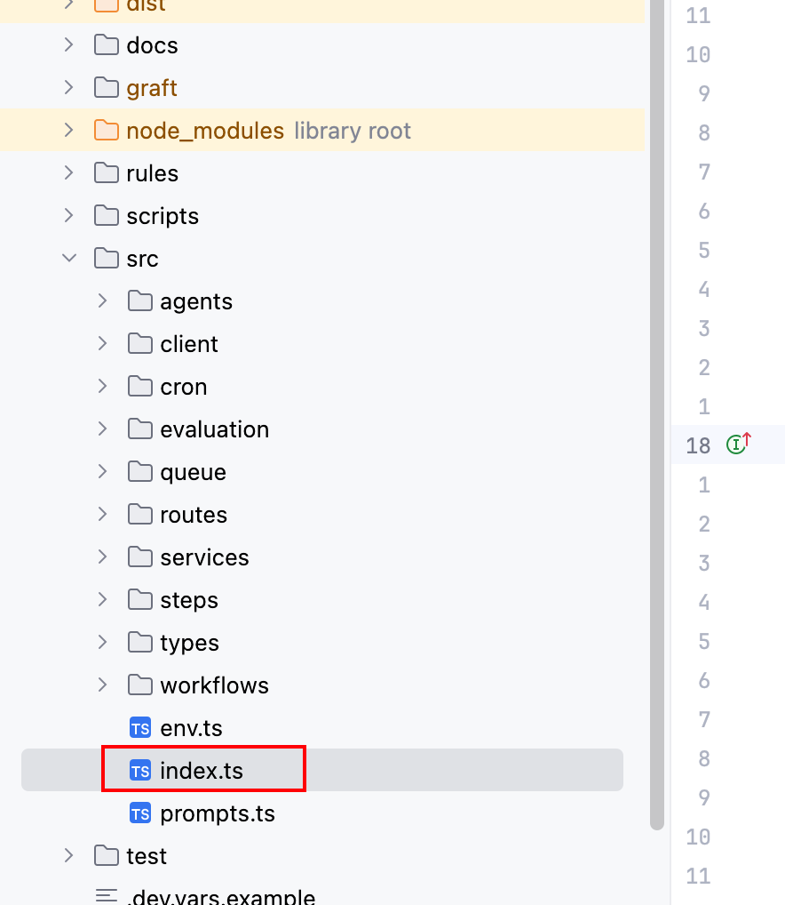

每个项目里的 index.ts 是什么作用?

实现事件钩子函数，由平台来调用.

Cloudflare's runtime calls it automatically when that event occurs. You don't call them yourself — the platform does.

Defines event handlers— It exports the functions that Cloudflare invokes, most commonly:

- fetch— handles incoming HTTP requests
- scheduled— runs on a cron trigger
- queue— processes messages from a Queue
- email— handles incoming emails

文件名默认是index.ts，你也可以指定其他名称，但需要在配置文件中映射下。
