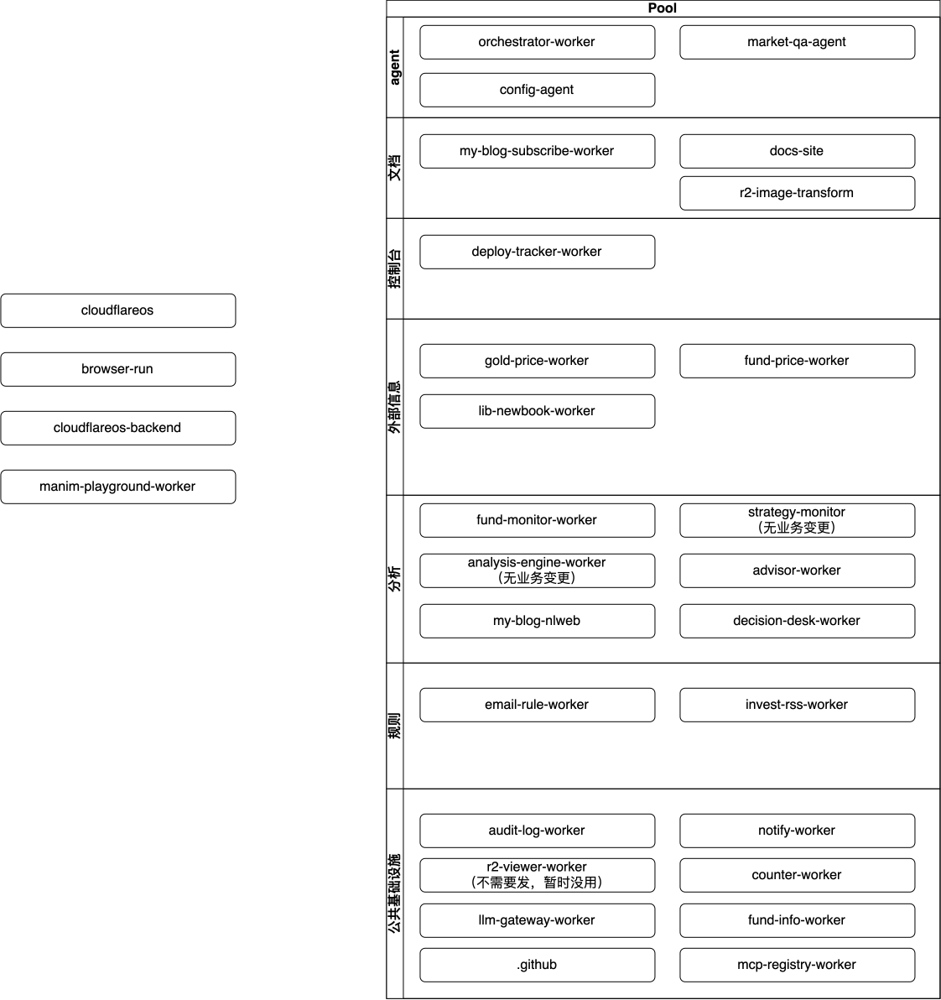

下面是我账户中涉及到的所有worker:

| Worker Name |
|---|
| advisor-worker |
| analysis-engine-worker |
| audit-log-worker |
| browser-run |
| cloudflareos |
| cloudflareos-backend |
| config-agent |
| counter-worker |
| decision-desk-worker |
| deploy-tracker-worker |
| docs-site |
| email-rule-worker |
| fund-info-worker |
| fund-monitor-worker |
| fund-price-worker |
| gold-price-worker |
| invest-rss-worker |
| lib-newbook-worker |
| llm-gateway-worker |
| manim-playground-worker |
| market-data-mcp |
| market-qa-agent |
| mcp-registry-worker |
| my-blog-nlweb |
| my-blog-subscribe-worker |
| notify-worker |
| orchestrator-worker |
| r2-image-transform |
| r2-viewer-worker |
| strategy-monitor |

### 一、系统架构总览

