| 术语              | 解释                             | 备注                                                                                                                         |
| ----------------- | -------------------------------- | ---------------------------------------------------------------------------------------------------------------------------- |
| jsrpc             | JavaScript RPC                   | Cloudflare's built-in mechanism for Worker-to-Worker function                                                                |
| CLI Onboarding    | CLI 入门引导（或命令行界面入门） |                                                                                                                              |
| durable execution | 持久执行                         | 在计算机科学（尤其是分布式系统、工作流引擎、事务处理）中，它通常指执行过程的状态被持久化存储，即使发生故障也能恢复并继续完成 |
| Instrumentation   | matrix device, 仪表、仪器        |                                                                                                                              |
| local inference   | 本地推理                         |                                                                                                                              |

### invocation

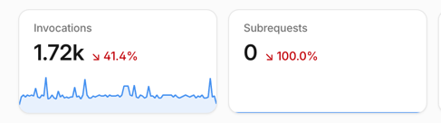

外部针对worker的请求

subrequest
worker内部向外发出的请求

### request id

这个在日志的链路中就是 request id

### Gradual deployments

渐进式部署

切流量的那种方式
https://developers.cloudflare.com/workers/versions-and-deployments/gradual-deployments/

### Flagship

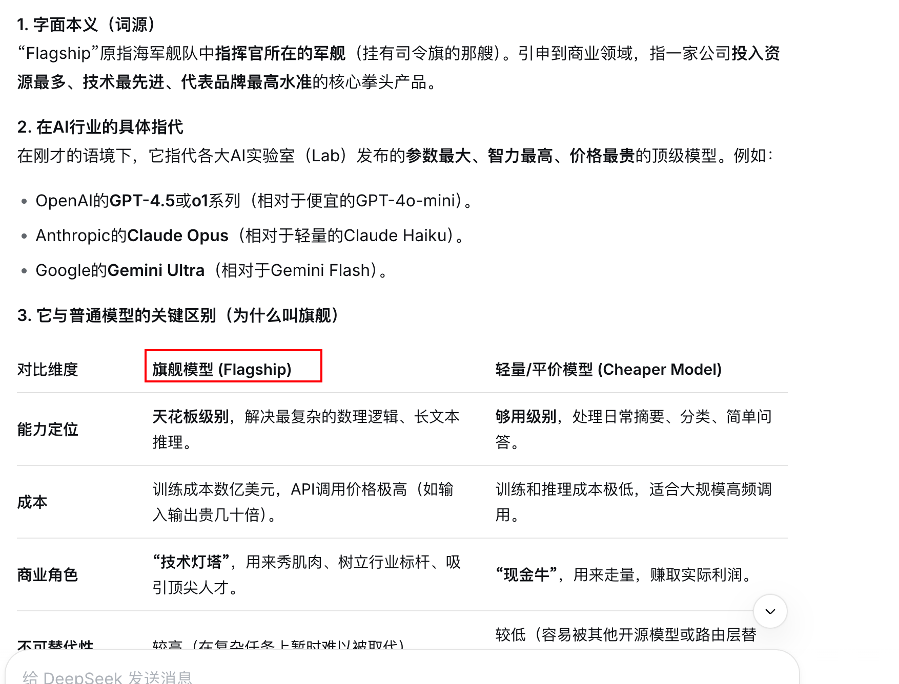

### 兼容日期

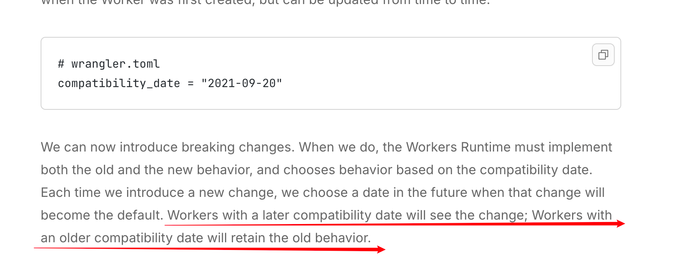

https://blog.cloudflare.com/backwards-compatibility-in-cloudflare-workers/

看了这篇博客
我认为每次部署都要检查下日期

https://blog.cloudflare.com/workerd-open-source-workers-runtime/

### workerd

一个始终向后兼容的运行时库

workerd
worker daemon

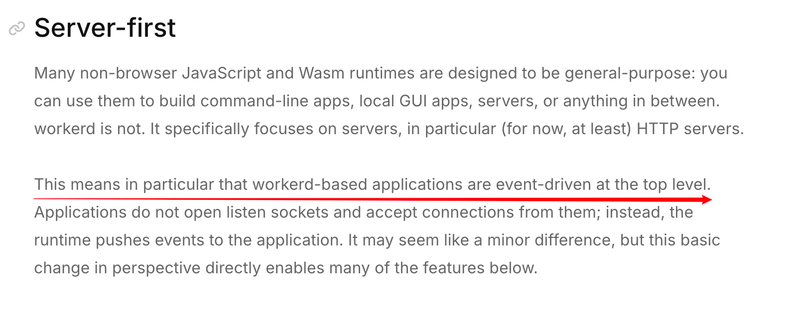
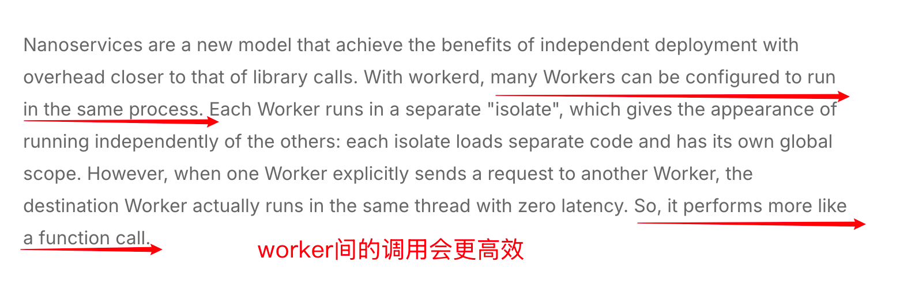

### tail worker

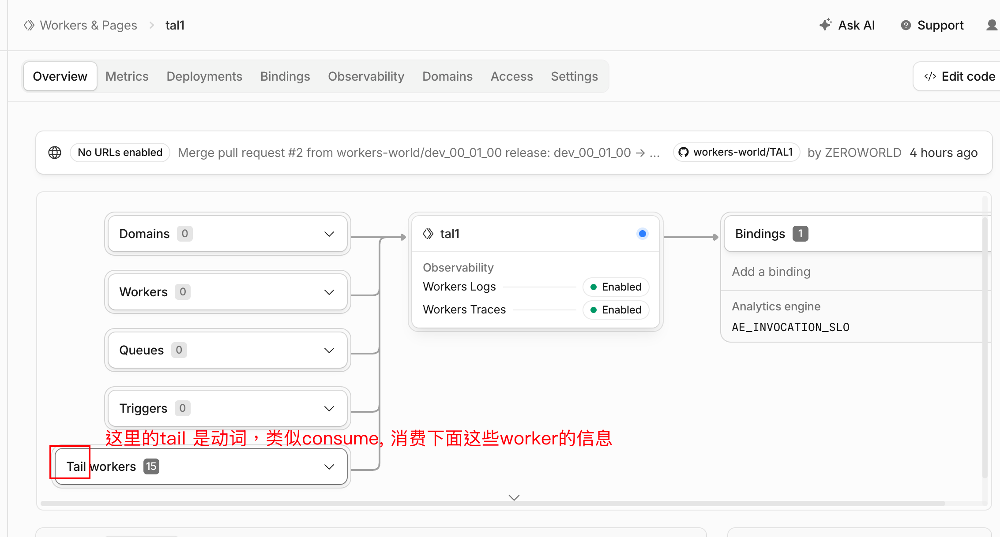

### workers ai

让worker绑定worker ai
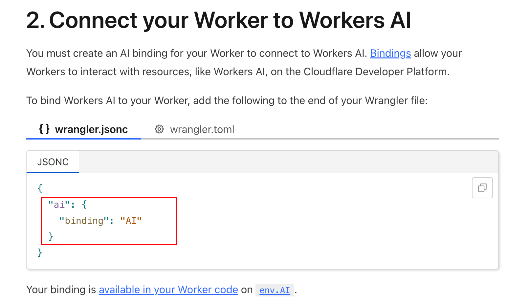
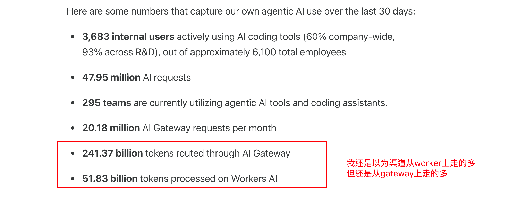
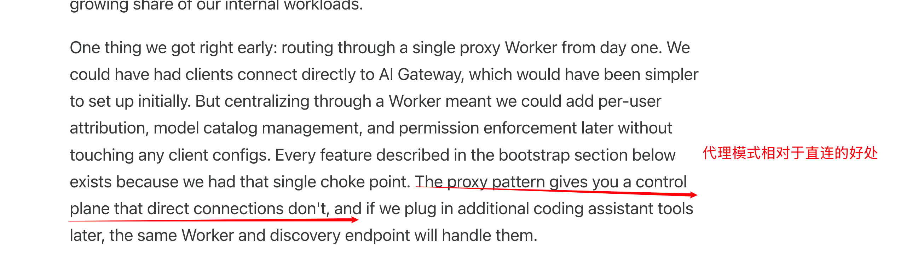

### ai search

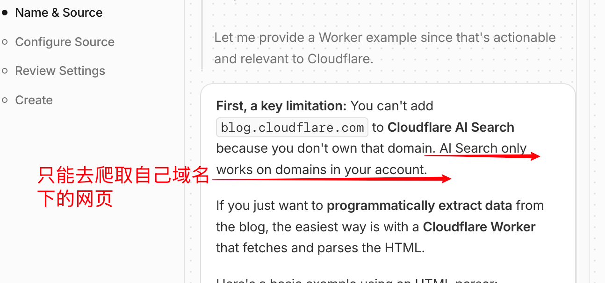
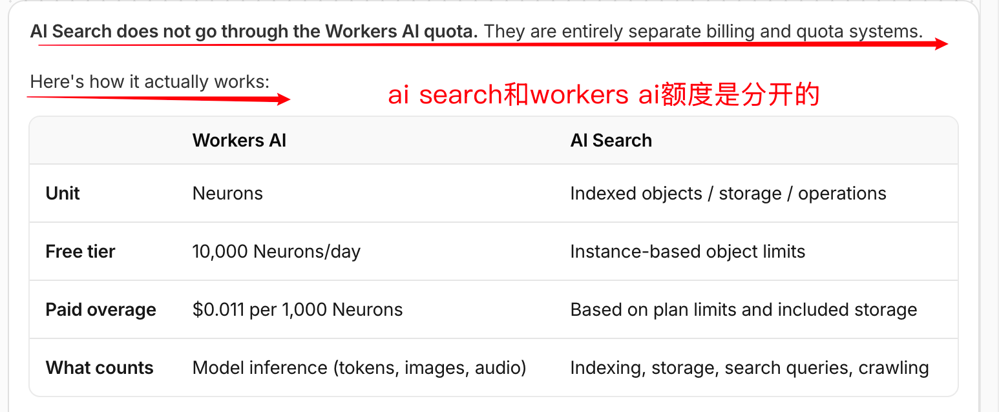

## 其他新闻

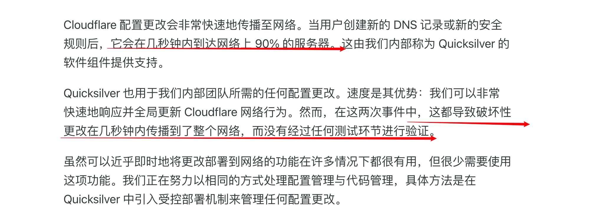

https://blog.cloudflare.com/ai-code-review/

看了下
很复杂的工程
当然他们的收获也是很高
