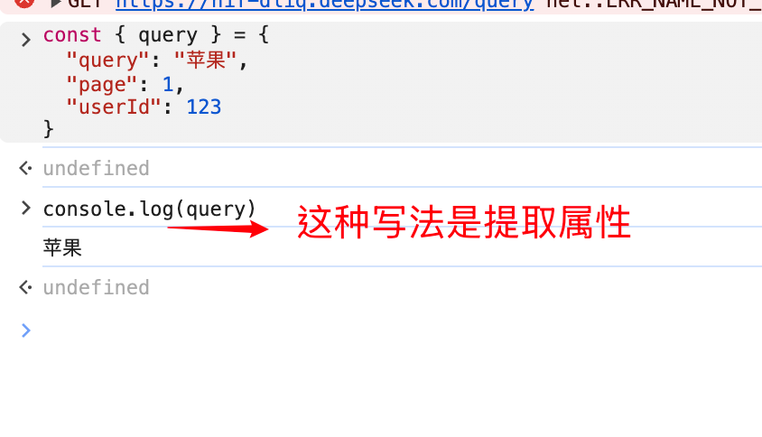

1. 问号
	```typescript
	export interface NotifyResult {
			ok: boolean;
			skipped?: boolean;
			reason?: string;
			id?: string;
			error?: string;
			status?: number;
	}
	```
	在 TypeScript 的接口（Interface）中，属性名后面的`?`表示该属性是可选属性（Optional Property）。
	这意味着：在实现这个接口的对象中，这个字段可以存在，也可以完全不存在（或者值为undefined）。


2. 提取属性

	
