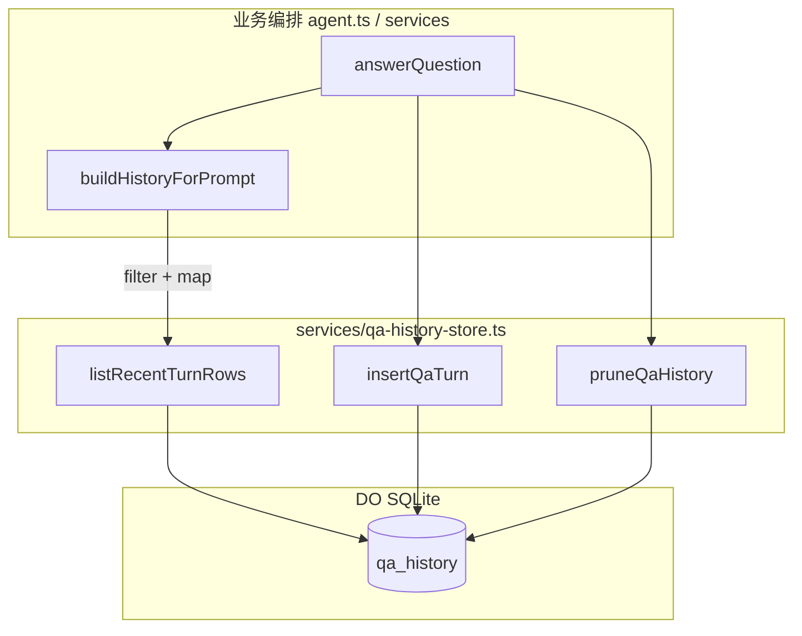

> 开发权威副本：`cloudflare_work/.cursor/rules/cloudflare-worker-*.mdc`  
> 本文是对外发布的精选摘要；规则变更时同步更新 Cursor rules 与本页。

## 1. 目标

各 Worker 遵循同一套分层：**入口只做 wiring，业务在 `services/`，持久化集中在 `*-store.ts`**。  
Agent / Durable Object 类（如 `MarketQaAgent`）只做编排与业务规则，不在类内散落 SQL。

## 2. 标准目录

```text
src/
├── env.ts          # Env 接口（必须独立，禁止写在 index.ts）
├── index.ts        # 入口：Hono + email / queue / scheduled 导出
├── types.ts        # 领域类型
├── routes/         # HTTP 路由（按资源拆分）
├── services/       # 业务逻辑 + 持久层（*-store.ts / *-query.ts）
├── queue/          # Queue consumer（xxx-consumer.ts）
├── evaluation/     # AI 输出校验
├── prompts/        # 静态 prompt 模板
└── types/          # 跨模块共享类型（可选）
```

### 职责边界

| 层 | 能调用 | 禁止 |
|----|--------|------|
| `routes/` | `services/`、`queue/` | 直接访问 `env.KV_*`、`env.DB_*`、`env.SVC_*` 等 binding |
| `services/` | env bindings、SDK、其他 `services/` | 调用 `routes/` |
| `queue/` | `services/` | 调用 `routes/` |
| `index.ts` | `services/`、`routes/`、`queue/` | 写业务逻辑 |
| Agent / DO 类 | `services/`、SDK | 在类内 inline 持久化 SQL（应抽到 store） |

## 3. 持久层命名

| 场景 | 文件命名 | 示例 |
|------|----------|------|
| D1 表 CRUD | `services/{表名}-store.ts` | `advice-store.ts`、`d1-store.ts` |
| 只读 / 复杂查询 | `services/*-query.ts` | Dashboard 筛选列表 |
| DO 内嵌 SQLite | `services/{表名}-store.ts` | `qa-history-store.ts` |

**禁止**：根目录 `db.ts`、随意新建 `repos/`（除非单个 store 过大再拆）。

## 4. D1：`QUERIES` 模式

D1 读写只放在 `services/*-store.ts`，使用 `env.DB_*.prepare(...).bind(...)`。

### 文件顶部

| 形式 | 用途 |
|------|------|
| `const QUERIES = { ... } as const` | 完整、静态 SQL（CRUD、固定 WHERE） |
| `SELECT_FIELDS` / `JOIN_*` | 多查询共享片段 |
| `buildWhere()` / `buildFilter()` | 动态条件 → `{ clause, binds }` |

```typescript
const QUERIES = {
  getById: `SELECT id, name FROM users WHERE id = ?`,
  insert: `INSERT INTO users (name, email) VALUES (?, ?)`,
} as const;

export async function getUser(env: Env, id: number) {
  return env.DB.prepare(QUERIES.getById).bind(id).first();
}
```

### 约定

- `QUERIES` 键名：`动词 + 实体`（`getById`、`listByFeed`、`upsertClassified`）
- 键名与 export 函数名对齐
- **禁止**用户输入拼进 SQL 字符串；LIKE 用 `?` + bind
- **禁止**在 `routes/` 内 `env.DB.prepare(...)`
- 动态 WHERE **不要**硬塞进 `QUERIES`；用片段 + `buildWhere`

### 参考实现

- `counter-worker/src/services/d1-sequence-store.ts`
- `invest-rss-worker/src/services/d1-store.ts`
- `advisor-worker/src/services/advice-store.ts`

## 5. DO SQLite：`*-store.ts` + 注入 `sql`

Agents SDK / Think 的 Durable Object 使用 **`this.sql` tagged template**（DO 内嵌 SQLite），**不是** D1 `prepare()`。

持久层仍放 `services/{表名}-store.ts`，但函数签名改为 **注入 sql 执行器**：

```typescript
/** 与 Agents SDK SqlProvider 对齐 */
export type QaHistorySql = <T = Record<string, string | number | boolean | null>>(
  strings: TemplateStringsArray,
  ...values: (string | number | boolean | null)[]
) => T[];

export function listRecentTurnRows(sql: QaHistorySql, limit: number): QaHistoryRow[] {
  return sql<QaHistoryRow>`
    SELECT question, answer, source, created_at
    FROM qa_history ORDER BY id DESC LIMIT ${limit}
  `;
}
```

### QUERIES 在 DO 场景的用法

DO 无法用 `prepare(QUERIES.x).bind()`，但仍保留 **`export const QUERIES`** 作为权威 SQL 文本，与下方 `sql\`...\`` 语句**一一对应**，便于 code review 与 diff。

### Agent 侧注入

在 DO 类内提供薄包装，保持 `this` 绑定：

```typescript
private qaSql(): QaHistorySql {
  return <T>(strings: TemplateStringsArray, ...values: (string | number | boolean | null)[]) =>
    this.sql<T>(strings, ...values);
}

override onStart(): void {
  ensureQaHistorySchema(this.qaSql());
}
```

### 参考实现

- `market-qa-agent/src/services/qa-history-store.ts`
- `market-qa-agent/src/agent.ts`（`qaSql()`、`buildHistoryForPrompt`）
- 单测：`market-qa-agent/test/services/qa-history-store.test.ts`（mock sql tag）

## 6. 业务层 vs 持久层

持久层只做：**建表、读写 raw rows、retention 剪除、Env 配置解析**。  
业务规则留在 Agent / `services/` 编排层。

| 职责 | 归属 | 示例 |
|------|------|------|
| `SELECT` / `INSERT` / `DELETE` | store | `listRecentTurnRows`、`insertQaTurn`、`pruneQaHistory` |
| 是否写入（fallback 不写） | 业务层 | `isUsefulAnswer(answer) && !result.fallback` |
| 哪些历史进 LLM prompt | 业务层 | `filter(isUsefulAnswer)`、`reverse`、映射为领域类型 |
| Env 缺省与正整数校验 | store 或 store 内 config 函数 | `resolveQaHistoryConfig(env)` |



### 反例

```typescript
// ❌ 在 Agent 类内 inline SQL
this.sql`INSERT INTO qa_history ...`;

// ❌ 把 isUsefulAnswer 过滤放进 store
export function listRecentTurnRows(sql, limit) {
  return rows.filter((r) => isUsefulAnswer(r.answer)); // 业务规则泄漏
}

// ❌ 根目录 db.ts
// ❌ 为 DO SQLite 再套一层 D1 式 env.DB 抽象
```

## 7. 代码风格（Biome）

- 所有 `if` / `for` / `while` 单语句体**必须写 `{}`**
- 权威规则源：`cloudflare_work/rules/biome-worker.json`；各 Worker `biome.json` extends `biome-shared.json`
- 修改后在该 Worker 目录执行：`npm run lint` 或 `npm run check`
- **禁止**裸跑 `npx biome`（会误装废弃包）

## 8. 新建 Worker checklist

- [ ] `src/env.ts` 含 Env 接口
- [ ] `src/index.ts` 仅 wiring
- [ ] 路由不直调 binding
- [ ] D1：SQL 进 `services/*-store.ts` + `QUERIES`
- [ ] DO SQLite：SQL 进 `services/*-store.ts` + 注入 `sql`
- [ ] Agent 类不含 inline 持久化逻辑
- [ ] store 层可 mock 单测（DO 用 mock sql tag）
- [ ] `npm run check` 通过

## 9. 增量迁移

- **touch 文件时**把 inline SQL 迁入 store；不开「全仓 SQL 重构」PR
- 2026-08 全仓整改批次已完成（见 §10）；此后新改动仍按本规范执行

## 10. 合规检查清单

扫描命令（meta 根目录，排除 `cloudflare-os`）：

```bash
# routes / index / Agent 内不得 prepare
rg '\.prepare\(' --glob '**/src/routes/**' --glob '**/src/index.ts' --glob '**/src/*agent*.ts'

# 不得残留根目录 db.ts
find . -path '*/cloudflare-os/*' -prune -o -name 'db.ts' -print

# services 外不得 inline 模板 SQL（cron 可调用 store）
rg -l 'prepare\(\s*`' --glob '*.{ts,js}' | rg -v '/services/|/test/|cloudflare-os'
```

期望：**上述三条均无命中**；D1/DO 读写仅在 `services/*-store.ts` / `*-query.ts`（或 JS 等价路径如 `r2-image-transform-worker/services/`）。

### 整改状态（2026-08）

| Worker | 状态 | 主要 store |
|--------|------|------------|
| market-qa-agent | ✅ 样板 | `qa-history-store.ts`（DO SQLite） |
| audit-log-worker | ✅ | `maintenance-log-store.ts` |
| browser_run | ✅ | `task-store.ts` |
| counter-worker | ✅ | `generate-id.ts` / `d1-sequence-store.ts` |
| fund-monitor-worker | ✅ | `d1-store.ts` |
| config-agent | ✅ | `operation-log-store.ts` |
| llm-gateway-worker | ✅ | `gateway-events-store.ts` |
| email-rule-worker | ✅ | `digest-store.ts` |
| advisor-worker | ✅ | `advice-store.ts`、`quota.ts` |
| decision-desk-worker | ✅ | `draft-store.ts`、`signal-buffer.ts` |
| lib-newbook-worker | ✅ | `newbook-store.ts`、`notify-clc-store.ts` |
| my-blog-subscribe-worker | ✅ | `subscriber-store.ts` 等 |
| container-mirror-host | ✅ | `job-store.ts` |
| invest-rss-worker | ✅ | 多 `services/*` QUERIES 化 |
| deploy-tracker-worker | ✅ | 全 `services/*` + cron 经 store |
| r2-image-transform-worker | ✅ | `services/image-access-store.js` |
| cloudflare-os | ⏸ 暂缓 | 与业务 Worker 规范独立 |

各 Worker 目录执行 `npm run check` 通过后方可合并。
