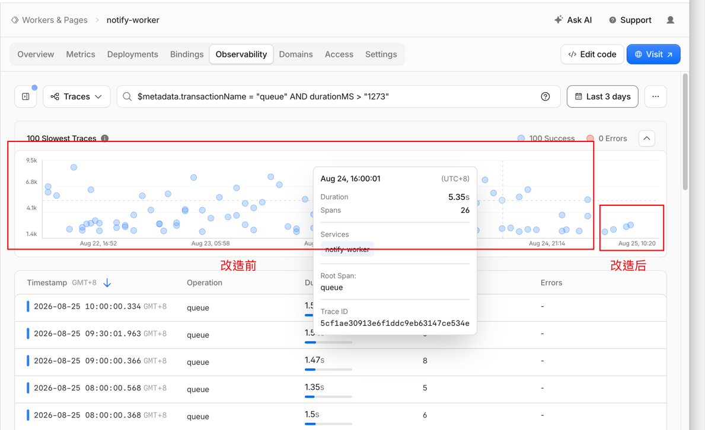
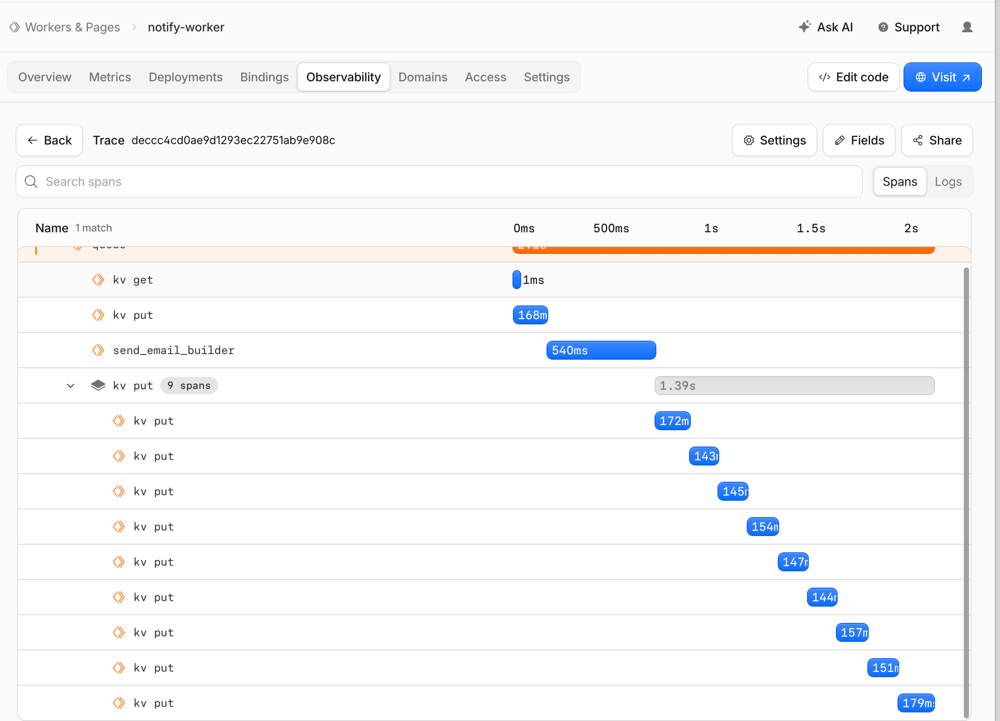
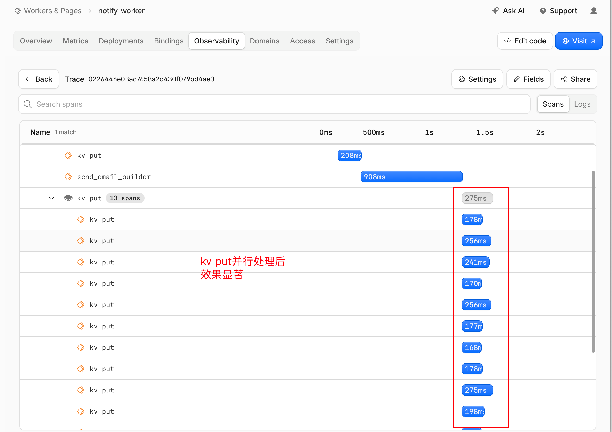
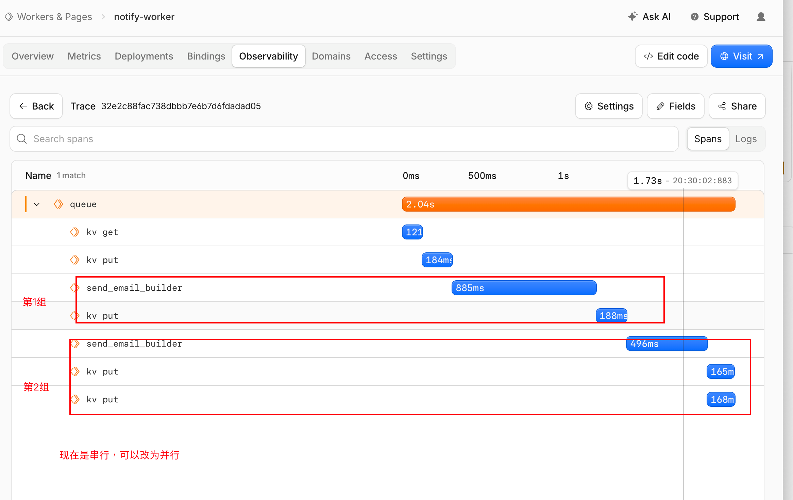
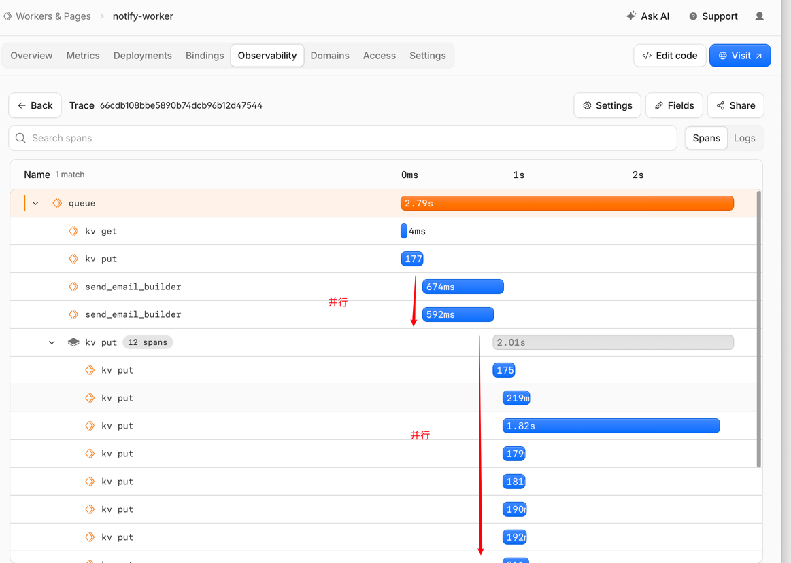
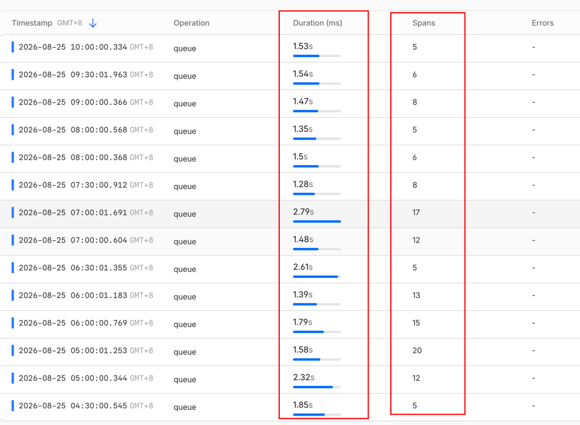

### 针对notify-worker 队列渠道处理的优化

为什么要进行这个优化：发送邮件通知是底层基础设施，是所有上层业务组件的公共复用组件。如果可以减少它的耗时，可以惠及所有上层业务。

现在先来看下改造前后的对比图

主要涉及两方面的修改

1. 针对kv put的优化：串行改为并行
	改造前
	

	改造后
	

2. 针对send_email_builder的优化：串行改为并行

	改造前
	

	改造后
	

	从下面这张图耗时变得很平均, span多和span少的耗时都是差不多。
	
